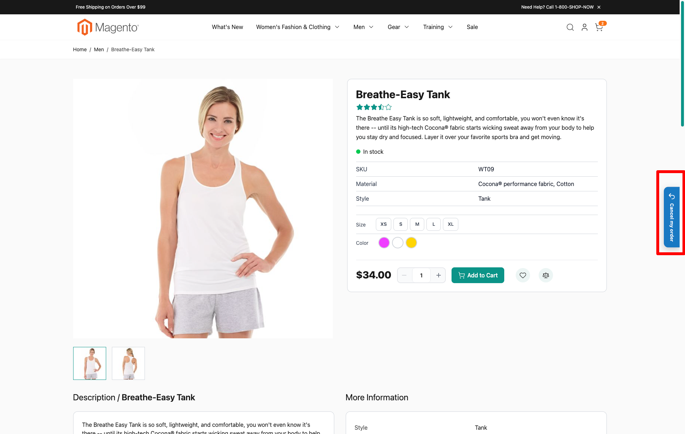
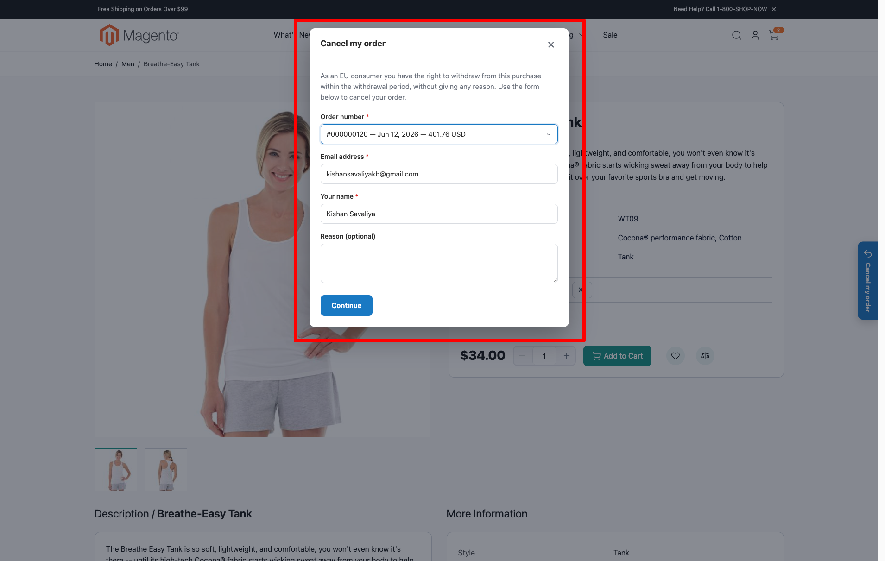
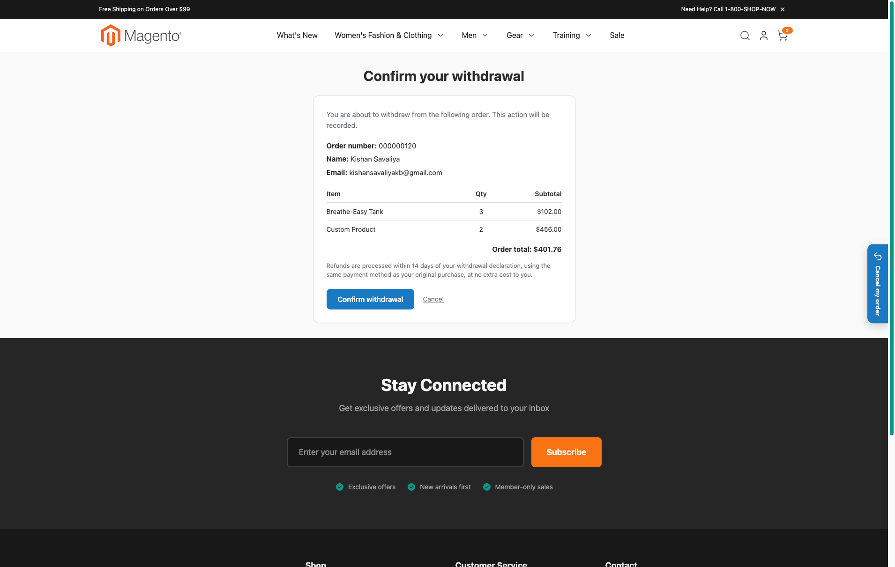
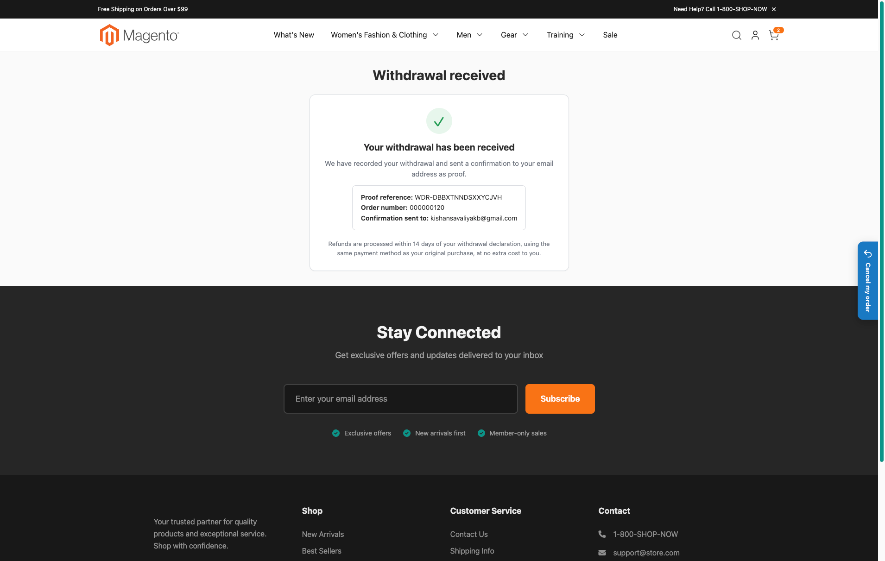
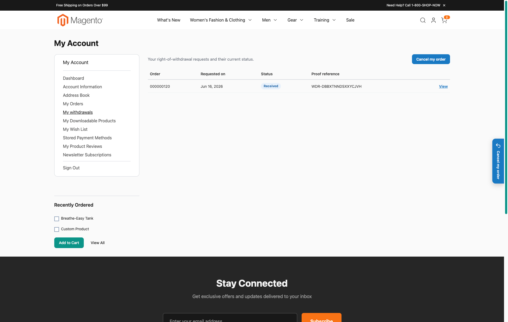
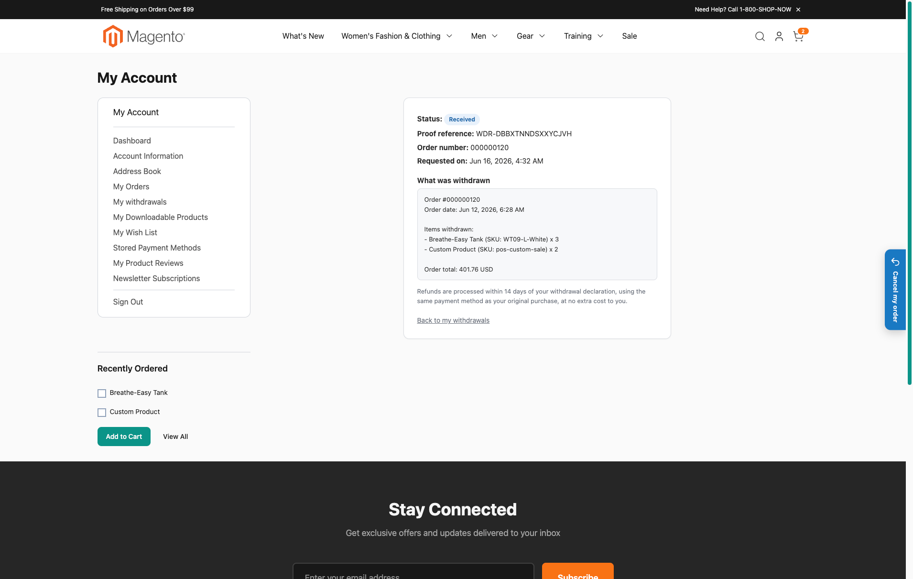
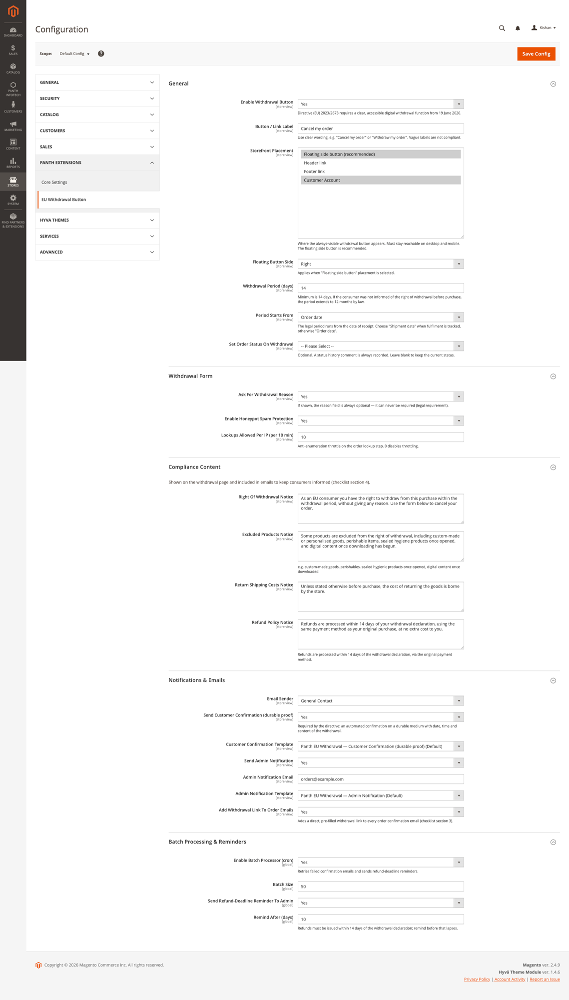
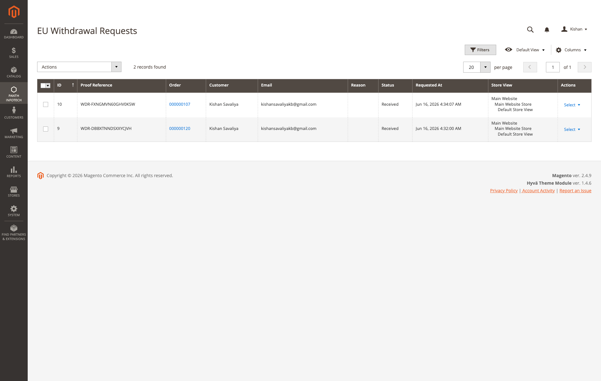
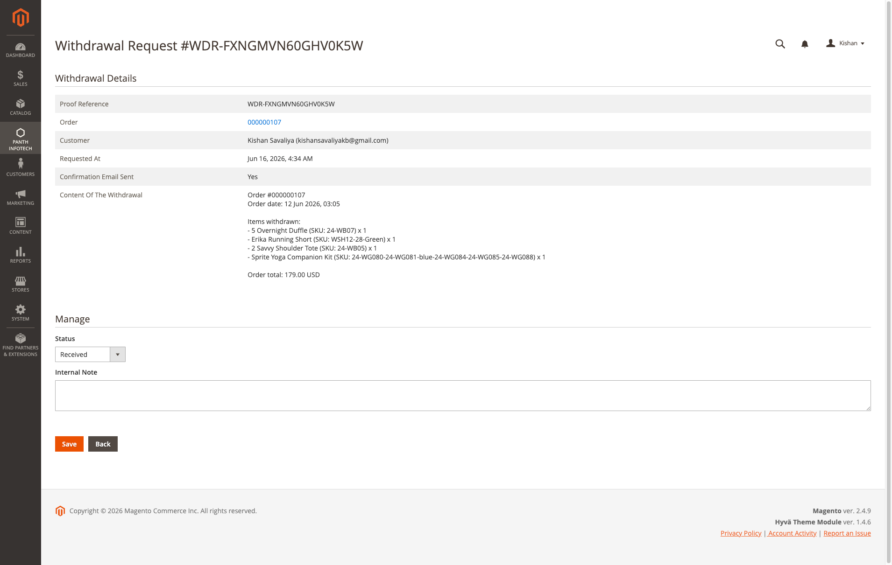
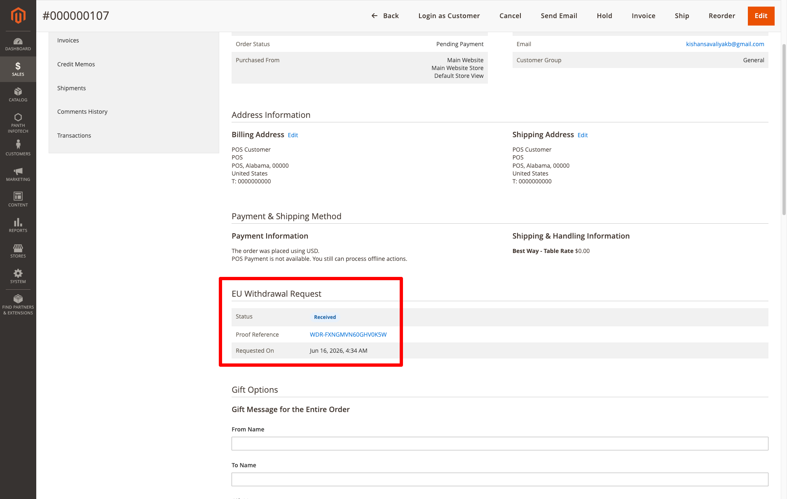

<!-- SEO Meta -->
<!--
  Title: Magento 2 EU Withdrawal Button: Directive (EU) 2023/2673 Order Cancellation Function | Hyva + Luma | Panth Infotech
  Description: Panth EU Withdrawal Button adds the digital cancellation function required by Directive (EU) 2023/2673 from 19 June 2026. Guest-capable two-step flow, durable-medium email proof, signed withdrawal link in order emails, configurable 14-day window, customer account history, admin request grid, and batch refund reminders. Native Hyva and Luma support. Built by Top Rated Plus Magento developer Kishan Savaliya.
  Keywords: magento 2 eu withdrawal button, directive eu 2023/2673 magento, magento 2 right of withdrawal, magento 2 order cancellation function, magento 2 cancel order button, magento 2 consumer rights, withdrawal button magento extension, hyva withdrawal button, luma withdrawal button, magento 2 14 day withdrawal
  Author: Kishan Savaliya (Panth Infotech)
  Canonical: https://kishansavaliya.com/magento-2-eu-withdrawal.html
-->

# Magento 2 EU Withdrawal Button: Directive (EU) 2023/2673 Order Cancellation Function (Hyva + Luma)

[](https://magento.com)
[](https://php.net)
[](https://www.hyva.io)
[](https://kishansavaliya.com/magento-2-eu-withdrawal.html)
[](https://packagist.org/packages/mage2kishan/module-eu-withdrawal)
[](https://www.upwork.com/freelancers/~016dd1767321100e21)
[](https://kishansavaliya.com)

> **Give EU shoppers the digital withdrawal button they are legally entitled to before 19 June 2026.** Directive (EU) 2023/2673 requires every online store selling to EU consumers to provide a clear, easy-to-find cancellation function. This module covers the full flow: a two-step form, durable-medium email proof, a signed link in order emails, customer account history, and admin request management.

**Product page:** [kishansavaliya.com/magento-2-eu-withdrawal.html](https://kishansavaliya.com/magento-2-eu-withdrawal.html)

---

## Quick Answer

**What is Panth EU Withdrawal Button?** It is a Magento 2 module that adds a compliant digital order withdrawal (cancellation) function as required by Directive (EU) 2023/2673, mandatory from 19 June 2026. Customers can cancel an order from a clearly visible button, without logging in, inside the legal withdrawal period.

**What does it add to my store?**

- An **always-visible floating withdrawal button** on every storefront page, plus optional header, footer, and account menu placements.
- A **two-step withdrawal form** so guests and logged-in customers can cancel by order number and email with no account required.
- A **durable-medium confirmation email** sent to the customer with proof reference, date, time, and withdrawal content.
- A **signed, pre-filled withdrawal link** injected into order confirmation emails, with no template editing needed.
- A **customer account "My withdrawals" page** listing all requests with status badges and a detail view.
- An **admin withdrawal requests grid** under Panth Extensions with filters, status column, and links to each order.
- A **batch cron job** that retries failed confirmation emails and sends staff refund-deadline reminders.

**Which themes are supported?** Both **Hyva** (Alpine.js + Tailwind CSS) and **Luma**. The active theme is detected automatically through `Panth_Core`.

**What does it need?** Magento 2.4.4 to 2.4.9, PHP 8.1 to 8.4, and the free `mage2kishan/module-core` package.

---

## Need Custom Magento 2 Development?

> **Get a free quote for your project in 24 hours** for custom modules, Hyva themes, performance work, M1 to M2 migrations, and Adobe Commerce Cloud.

<p align="center">
  <a href="https://kishansavaliya.com/get-quote">
    
  </a>
</p>

<table>
<tr>
<td width="50%" align="center">

### Kishan Savaliya
**Top Rated Plus on Upwork**

[](https://www.upwork.com/freelancers/~016dd1767321100e21)

100% Job Success • 10+ Years Magento Experience
Adobe Certified • Hyva Specialist

</td>
<td width="50%" align="center">

### Panth Infotech Agency
**Magento Development Team**

[](https://www.upwork.com/agencies/1881421506131960778/)

Custom Modules • Theme Design • Migrations
Performance • SEO • Adobe Commerce Cloud

</td>
</tr>
</table>

**Visit our website:** [kishansavaliya.com](https://kishansavaliya.com) &nbsp;|&nbsp; **Get a quote:** [kishansavaliya.com/get-quote](https://kishansavaliya.com/get-quote)

---

## Table of Contents

- [Who Is It For](#who-is-it-for)
- [Key Features](#key-features)
- [Compatibility](#compatibility)
- [Installation](#installation)
- [Configuration](#configuration)
- [How It Works](#how-it-works)
- [FAQ](#faq)
- [Support](#support)
- [About Panth Infotech](#about-panth-infotech)
- [Quick Links](#quick-links)

---

## Who Is It For

- **EU-facing stores** that must comply with Directive (EU) 2023/2673 before 19 June 2026 and need the digital cancellation function ready to go.
- **Stores with guest checkout** where customers place orders without an account and still need a straightforward way to withdraw.
- **Merchants who want a paper trail** on every withdrawal, with a proof reference, status workflow, and admin notes kept in one place.
- **Hyva storefronts** that need the withdrawal button built on Alpine.js with no jQuery added back in.
- **Multi-language stores** selling to shoppers in the Netherlands, Germany, and France, where the module ships built-in translations.

---

## Key Features

### Storefront Entry Points
- **Always-visible floating side tab** on every page, left or right, fully configurable.
- **Header, footer, and customer account menu** placements as optional additions.
- **"Cancel my order" button on the order view page** for logged-in customers, pre-filled and signed per order.
- **Pop-up modal** on click from any entry point; falls back to a dedicated `/withdrawal` page when JavaScript is off.

### Two-Step Withdrawal Flow
- **Step 1** collects only order number, email, and name, plus an optional reason.
- **Logged-in customers** get an order dropdown of eligible orders, with name and email pre-filled.
- **Step 2** shows an order summary and a "Confirm withdrawal" button before anything is recorded.
- A **proof page** with a unique reference closes the flow.
- **One request per order** - a second attempt shows the existing request's status instead of creating a duplicate.

### Durable-Medium Email Proof
- **Customer confirmation email** with the proof reference, exact date and time, and the full withdrawal content.
- **Admin notification email** for every new request.
- **Signed, pre-filled withdrawal link** injected into order confirmation emails, with no template editing required.
- **Refund-deadline reminder email** to staff before the 14-day refund window lapses.

### Customer Account History
- A **"My withdrawals" page** lists every request with order, date, status badge, and proof reference.
- A **View** action opens a read-only detail page for each request.
- Ownership is enforced - a customer can only see their own requests.

### Admin Management
- A dedicated **EU Withdrawal Requests grid** under Panth Extensions, with filters, status column, and links to each order.
- A **request detail screen** to read the full proof content, change status (Received, Acknowledged, Refunded, Rejected), and add an internal note.
- An **"EU Withdrawal Request" panel on the admin order view**, linking the order to its request and showing current status.

### Compliance, Window, and Settings
- **Configurable withdrawal period** (default 14 days), counted from the order date or shipment date.
- **Editable compliance notices** for right of withdrawal, excluded products, return shipping costs, and refunds.
- **Optional order status** applied on withdrawal; a status-history comment is always recorded.

### Anti-Abuse and Performance
- **Honeypot field, JavaScript speed-trap, and per-IP rate limiting** on the public lookup step.
- **Signed HMAC tokens** prevent order-number guessing and power the pre-filled email links.
- **No personal data exposed** to anyone who cannot prove order ownership.
- Front-end markup stays **Full Page Cache friendly**; customer-specific data loads through a session request.

### Hyva + Luma Ready
- **Native Hyva templates** built on Alpine.js with Tailwind CSS, CSP-safe with no inline styles or scripts.
- **Native Luma templates** using standard Magento layout and UI components.
- **Theme is detected for you** through `Panth\Core\Helper\Theme`.
- **Translations** for English, Dutch, German, and French ship out of the box.

### Built to Last
- **Clean, MEQP-style code** with constructor dependency injection only.
- **Full Page Cache friendly** storefront markup.
- **Translation ready** - every label uses Magento's `__()` function.
- **Batch cron** retries failed confirmation emails so the durable-proof guarantee holds even if mail was briefly unavailable.

---

## Compatibility

| Requirement | Versions Supported |
|---|---|
| Magento Open Source | 2.4.4, 2.4.5, 2.4.6, 2.4.7, 2.4.8, 2.4.9 |
| Adobe Commerce | 2.4.4, 2.4.5, 2.4.6, 2.4.7, 2.4.8, 2.4.9 |
| Adobe Commerce Cloud | 2.4.4 to 2.4.9 |
| PHP | 8.1.x, 8.2.x, 8.3.x, 8.4.x |
| MySQL | 8.0+ |
| MariaDB | 10.4+ |
| Hyva Theme | 1.1+ (native Alpine.js support) |
| Luma Theme | Native support |
| Required Dependency | `mage2kishan/module-core` ^1.0 (free) |

---

## Installation

### Composer Installation (Recommended)

```bash
composer require mage2kishan/module-eu-withdrawal
bin/magento module:enable Panth_Core Panth_EuWithdrawal
bin/magento setup:upgrade
bin/magento setup:di:compile
bin/magento setup:static-content:deploy -f
bin/magento cache:flush
```

### Manual Installation via ZIP

1. Download the latest release from [Packagist](https://packagist.org/packages/mage2kishan/module-eu-withdrawal) or from the [product page](https://kishansavaliya.com/magento-2-eu-withdrawal.html).
2. Extract it to `app/code/Panth/EuWithdrawal/` in your Magento install.
3. Make sure `Panth_Core` is installed too (required dependency).
4. Run the commands above starting from `bin/magento module:enable`.

### Verify Installation

```bash
bin/magento module:status Panth_EuWithdrawal
# Expected: Module is enabled
```

After install, open:
```
Admin -> Stores -> Configuration -> Panth Extensions -> EU Withdrawal Button
```

---

## Configuration

Go to **Stores -> Configuration -> Panth Extensions -> EU Withdrawal Button**.

### General

| Setting | Group | Default | Description |
|---|---|---|---|
| Enable Withdrawal Button | General | Yes | Master toggle for the whole withdrawal feature. |
| Button / Link Label | General | Cancel my order | The visible label. Use clear wording; vague labels are not compliant. |
| Storefront Placement | General | Floating + Account | Where the always-visible button appears: floating side tab, header, footer, account. |
| Floating Button Side | General | Right | Right or left, when the floating side tab is used. |
| Withdrawal Period (days) | General | 14 | Minimum is 14. Extends to 12 months if the customer was not informed before purchase. |
| Period Starts From | General | Order date | Order date or shipment date (date of receipt). |
| Set Order Status On Withdrawal | General | (none) | Optional status applied on withdrawal. A comment is always recorded. |

### Withdrawal Form

| Setting | Group | Default | Description |
|---|---|---|---|
| Ask For Withdrawal Reason | Form | Yes | When shown, the reason field is always optional. |
| Enable Honeypot Spam Protection | Form | Yes | Hidden trap plus a JavaScript speed-check on the lookup step. |
| Lookups Allowed Per IP (per 10 min) | Form | 10 | Anti-enumeration throttle on the lookup step. 0 disables it. |

### Compliance Content

| Setting | Group | Description |
|---|---|---|
| Right Of Withdrawal Notice | Compliance | Shown on the form and in emails. |
| Excluded Products Notice | Compliance | Custom-made goods, perishables, sealed hygiene items, downloaded digital content, and so on. |
| Return Shipping Costs Notice | Compliance | Who pays for returns. |
| Refund Policy Notice | Compliance | How and when refunds are issued. |

### Notifications and Emails

| Setting | Group | Default | Description |
|---|---|---|---|
| Email Sender | Notifications & Emails | General Contact | Sender identity for outgoing mail. |
| Send Customer Confirmation (durable proof) | Notifications & Emails | Yes | The required durable-medium confirmation. |
| Customer Confirmation Template | Notifications & Emails | Panth default | Email template for the confirmation. |
| Send Admin Notification | Notifications & Emails | Yes | Notify staff of new requests. |
| Admin Notification Email | Notifications & Emails | (blank) | Recipient for admin notifications. |
| Admin Notification Template | Notifications & Emails | Panth default | Email template for admin notices. |
| Add Withdrawal Link To Order Emails | Notifications & Emails | Yes | Injects a signed, pre-filled link into order confirmation emails. |

### Batch Processing and Reminders

| Setting | Group | Default | Description |
|---|---|---|---|
| Enable Batch Processor (cron) | Batch Processing & Reminders | Yes | Retries failed confirmation emails and sends refund reminders. |
| Batch Size | Batch Processing & Reminders | 50 | Records processed per run. |
| Send Refund-Deadline Reminder To Admin | Batch Processing & Reminders | Yes | Reminds staff before the 14-day refund window lapses. |
| Remind After (days) | Batch Processing & Reminders | 10 | Days after the request before the reminder is sent. |

All settings respect Magento's scope hierarchy (default, website, store view).

---

## How It Works

1. The **floating side tab** (or header/footer/account link) is visible on every storefront page.
2. On click, the **withdrawal modal** opens in place. Without JavaScript, the browser goes to the `/withdrawal` page.
3. **Step 1** - the customer enters order number, email, and name. Logged-in customers pick the order from a dropdown. The reason is optional.
4. The store checks the order exists, the email matches, and the order is still inside the withdrawal period. Abuse checks (honeypot, speed-trap, rate limit, HMAC token) run here.
5. **Step 2** - the customer sees an order summary and clicks "Confirm withdrawal".
6. The withdrawal is written to the `panth_eu_withdrawal_request` table with a unique proof reference. A status-history comment is added to the order. The optional order status is applied.
7. A **confirmation email** is sent to the customer as durable-medium proof. Staff are notified.
8. The customer sees a **proof page** with the reference number.
9. Logged-in customers can review all their requests under **My Account -> My withdrawals**.
10. Admins manage requests at **Panth Extensions -> EU Withdrawal Button -> Withdrawal Requests**.

---

## Screenshots

### Storefront

**Always-visible floating "Cancel my order" tab on every page (Hyva shown):**



**Pop-up withdrawal form - logged-in customers pick the order from a dropdown, with name and email pre-filled:**



**Step 2 - order summary and "Confirm withdrawal" before anything is recorded:**



**Proof page with the unique reference after the withdrawal is recorded:**



### Customer Account

**"My withdrawals" history, placed right after "My Orders", with status badges and a View action:**



**Per-request detail with status, proof reference and the full content of the withdrawal:**



### Admin

**Configuration - General, Form, Compliance Content, Notifications and Batch Processing:**



**EU Withdrawal Requests grid with status column, order links and filters:**



**Request detail - proof content, status workflow and internal note:**



**"EU Withdrawal Request" panel on the sales order view, linking the order to its request:**



---

## FAQ

### Does it work for guest orders?
Yes. Customers cancel by entering the order number and email; no account is required.

### Can a customer withdraw the same order twice?
No. A second attempt shows the existing request's status page instead of creating a duplicate entry.

### Does it cancel or refund the order automatically?
No. It records the request, comments the order, optionally sets a status, and notifies staff. Your team handles the refund inside the legal window.

### Does it support Hyva?
Yes, natively. The same withdrawal flow renders on both Hyva (Alpine.js) and Luma. The module reads the active theme through `Panth_Core` and serves the correct markup.

### Will it work with Full Page Cache?
Yes. The storefront markup is cacheable. Customer-specific data, such as the order dropdown for logged-in customers, loads through a session request, not from cached HTML.

### Is the reason field required?
Never. If you choose to show it, it stays optional, as the directive requires.

### Can I edit the compliance text shown on the form and in emails?
Yes. The notices are admin settings under the Compliance Content group, and the email templates are standard Magento transactional templates you can override in your theme.

### Is the confirmation email legally required?
Yes. The directive requires an automatic confirmation on a durable medium (such as email) with the date, time, and content of the withdrawal. This module sends it and retries via cron if the first attempt fails.

### What Magento versions are supported?
Magento Open Source and Adobe Commerce 2.4.4 to 2.4.9, PHP 8.1 to 8.4.

### Is Panth_Core required?
Yes. `mage2kishan/module-core` is a required dependency and is pulled in automatically by Composer.

### Is this legal advice?
No. It provides the technical cancellation function and workflow. Configure the notices and refund process to match your own terms and local implementation of the directive.

---

## Support

| Channel | Contact |
|---|---|
| Product Page | [kishansavaliya.com/magento-2-eu-withdrawal.html](https://kishansavaliya.com/magento-2-eu-withdrawal.html) |
| Email | kishansavaliyakb@gmail.com |
| Website | [kishansavaliya.com](https://kishansavaliya.com) |
| WhatsApp | +91 84012 70422 |
| GitHub Issues | [github.com/mage2sk/module-eu-withdrawal/issues](https://github.com/mage2sk/module-eu-withdrawal/issues) |
| Upwork (Top Rated Plus) | [Hire Kishan Savaliya](https://www.upwork.com/freelancers/~016dd1767321100e21) |
| Upwork Agency | [Panth Infotech](https://www.upwork.com/agencies/1881421506131960778/) |

Response time: 1-2 business days.

### Need Custom Magento Development?

Looking for **custom Magento module development**, **Hyva theme work**, **store migrations**, or **performance tuning**? Get a free quote in 24 hours:

<p align="center">
  <a href="https://kishansavaliya.com/get-quote">
    
  </a>
</p>

<p align="center">
  <a href="https://www.upwork.com/freelancers/~016dd1767321100e21">
    
  </a>
  &nbsp;&nbsp;
  <a href="https://www.upwork.com/agencies/1881421506131960778/">
    
  </a>
  &nbsp;&nbsp;
  <a href="https://kishansavaliya.com/magento-2-eu-withdrawal.html">
    
  </a>
</p>

---

## About Panth Infotech

Built and maintained by **Kishan Savaliya** ([kishansavaliya.com](https://kishansavaliya.com)), a **Top Rated Plus** Magento developer on Upwork with 10+ years of eCommerce experience.

**Panth Infotech** is a Magento 2 development agency that builds high quality, security focused extensions and themes for both Hyva and Luma storefronts. The extension suite covers SEO, performance, checkout, product presentation, customer engagement, compliance, and store management, with each module built to MEQP standards and tested across Magento 2.4.4 to 2.4.9.

Browse the full extension catalog on our [Magento extensions page](https://kishansavaliya.com/magento-extensions.html) or on [Packagist](https://packagist.org/packages/mage2kishan/).

---

## Quick Links

| Resource | Link |
|---|---|
| **Product Page** | [magento-2-eu-withdrawal.html](https://kishansavaliya.com/magento-2-eu-withdrawal.html) |
| **Packagist** | [mage2kishan/module-eu-withdrawal](https://packagist.org/packages/mage2kishan/module-eu-withdrawal) |
| **GitHub** | [mage2sk/module-eu-withdrawal](https://github.com/mage2sk/module-eu-withdrawal) |
| **Website** | [kishansavaliya.com](https://kishansavaliya.com) |
| **Free Quote** | [kishansavaliya.com/get-quote](https://kishansavaliya.com/get-quote) |
| **Upwork (Top Rated Plus)** | [Hire Kishan Savaliya](https://www.upwork.com/freelancers/~016dd1767321100e21) |
| **Upwork Agency** | [Panth Infotech](https://www.upwork.com/agencies/1881421506131960778/) |
| **Email** | kishansavaliyakb@gmail.com |
| **WhatsApp** | +91 84012 70422 |

---

<p align="center">
  <strong>Get your store ready for Directive (EU) 2023/2673 before 19 June 2026.</strong><br/>
  <a href="https://kishansavaliya.com/magento-2-eu-withdrawal.html">
    
  </a>
</p>

---

**SEO Keywords:** magento 2 eu withdrawal button, directive eu 2023/2673 magento, magento 2 right of withdrawal, magento 2 order cancellation function, magento 2 cancel order button, magento 2 consumer rights directive, magento 2 withdrawal module, magento 2 14 day cancellation right, magento 2 cooling off period, magento 2 distance selling rules, withdrawal button magento extension, hyva withdrawal button, luma withdrawal button, magento 2 guest order cancellation, magento 2 refund workflow, magento 2 order email cancellation link, magento 2 durable medium confirmation, magento 2 eu compliance module, magento 2.4.9 withdrawal module, magento php 8.4 compliance module, mage2kishan eu withdrawal, panth eu withdrawal, panth infotech withdrawal button, eu 2023/2673 cancellation function, magento 2 widerruf button, magento 2 herroepingsrecht, kishan savaliya magento, hire magento developer upwork, top rated plus magento freelancer, custom magento development
